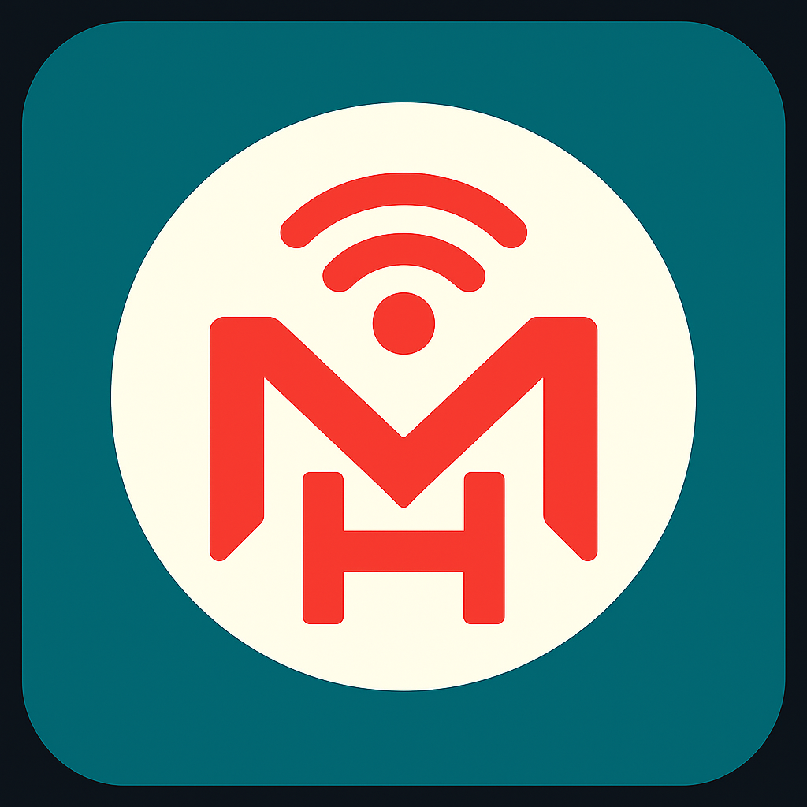
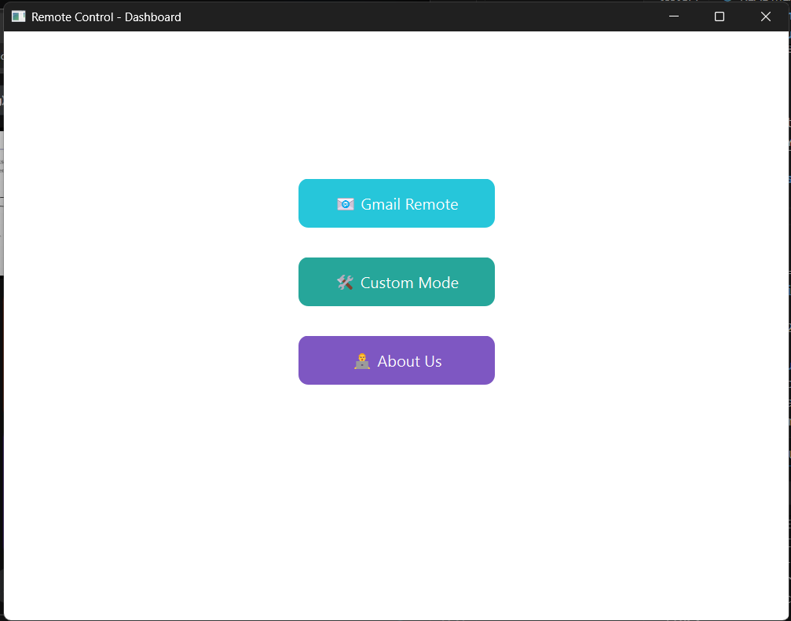
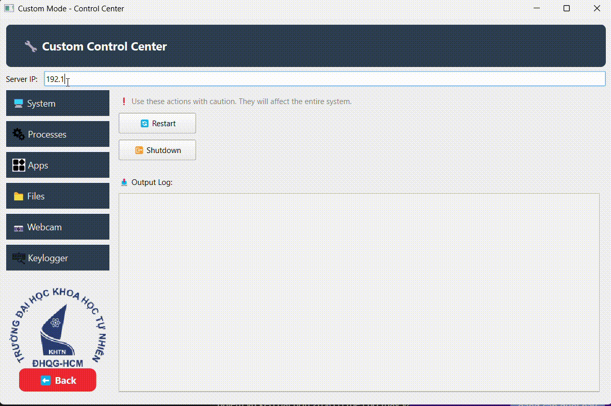
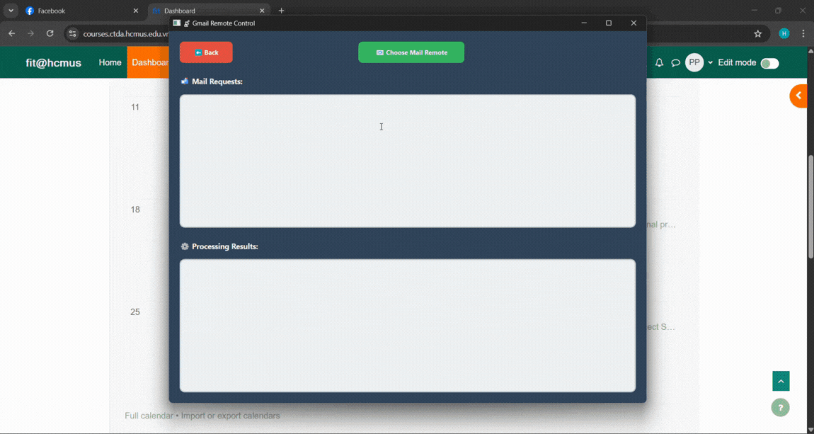
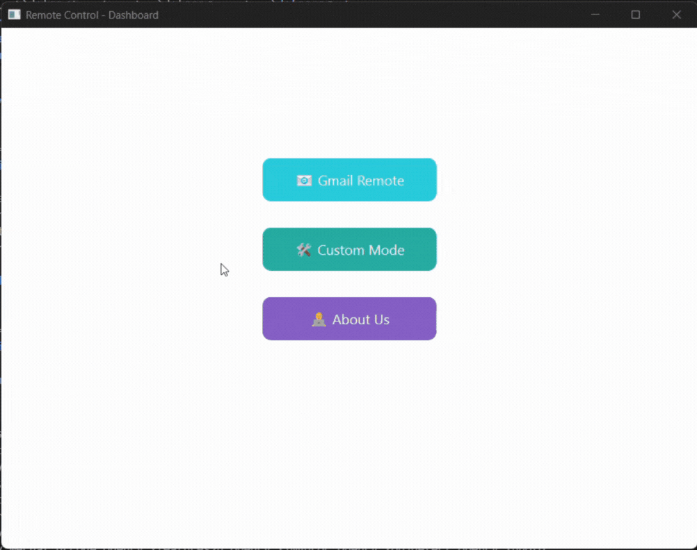

<h1 align="center">
  </img>
  <br>
  <b>Gmail Remote Control C++</b>
</h1>

<p align="center">Program to control remote computer by Gmail using C++ and Qt.</p>
<div align="center">
  <b>
      <a href="https://youtu.be/bdlXKWeg4tY">Demo</a>
    <span> · </span>
      <a href="#about-the-project">About the project</a>
        <span> · </span>
      <a href="#getting-start">Getting start</a> 
        <span> · </span>
      <a href="#description">Description</a>
      <span> · </span>
      <a href="#member">Member</a>
      <span> · </span>
      <a href="#references">References</a>
  </b>
</div>

## Table of contents

- [Table of contents](#table-of-contents)
- [About the project](#about-the-project)
   - [Introduction](#introduction)
   - [Demo](#demo)
   - [Screenshots](#screenshots)
      - [Dashboard](#dashboard)
      - [Custommode](#custommode)
      - [Mailremote](#mailremote)
      - [SendMail](#sendmail)
      - [Detail information](#detail-information)
   - [Technology](#technology)
   - [Features](#features)
- [Getting start](#getting-start)
   - [Prerequisites](#prerequisites)
   - [Run locally](#run-locally)
- [Member](#member)
- [References](#references)

## About the project

### Introduction

This project is a **remote computer control system using Gmail**, built with C++ and Qt, in which:

- **The user** sends a Gmail message to the fixed **client Gmail** .
- **The client** receives the email, extracts the command from subject (server IP, e.g., `192.168.1.1`) and body (e.g.), and sends a JSON signal to the **server** via TCP socket (port 12345).
- **The server** executes the task and returns the result to the **client**.
- **The client** sends the result back to the **user's Gmail**.

### Demo

Check out the [**demo video**](https://youtu.be/bdlXKWeg4tY) to see the application in action.

### Screenshots

#### Dashboard

<figure>
  
  <figcaption>Dashboard page</figcaption>
</figure>

User has 2 choices to use the program:

- **Custom mode**: Send commands directly from the client to the server, and view the response instantly in the client app.
- **Mail remote**: Select a Gmail account to remotely control the system by sending an email to the client. The client reads the command, sends it to the server, receives the response, and sends it back to the user's Gmail.

#### Custommode

<figure>
  
  <figcaption>Custommode page</figcaption>
</figure>

Allow user selects the command to be executed by the server, the program will auto generate to JSON and send to server.

#### Mailremote

<figure>
  
  <figcaption>Mailremote page</figcaption>
</figure>

The application allows the user to select **Gmail Remote** to connect with the Gmail client via **OAuth2 authentication**. After successful authorization, the program will wait for the server’s response and display the result in a dedicated window with background `#2c3e50`.

#### SendMail

<figure>
  
  <figcaption>Mail demo page</figcaption>
</figure>

The application continuously listens for new messages sent from the Gmail user to the client. Upon receiving a valid signal, the client processes the command and forwards it to the server.

#### Detail information

<figure>
  
  <figcaption>About us</figcaption>
</figure>

Show information about the project and the members.

### Technology

- **Framework**: Qt, CMake
- **Backend**: C++,SocketIO
- **Frontend**: Qt Widgets, QML

### Features

**Client application**: A GUI app to control remote computer:
- Send commands to server (port 12345).
- Get and show reply (text or `.txt`, `.jpg`, `.avi`).
- View logs in `textResults` (`#ecf0f1`, Consolas).
- OAuth2 with auto-close `localhost:50000` (3s).
- Timeout: 5s (text), 10s (`capture_photo`, `download_file`), 30s (`record_video`).

**Server application**:
- Key logger: Capture keystrokes.
- Shutdown/logout: Shutdown or logout computer.
- MAC address: Get MAC address.
- Screenshot: Save as `.jpg`.
- Webcam: Capture image as `.jpg`.
- Directory tree: List, copy, delete files.
- App process: List, start, stop processes/apps.

## Getting start

### Prerequisites

- **OS**: Windows (MYSY2), Linux, or macOS.
- **Compiler**: C++17 (e.g., MinGW, GCC, Clang).
- **Dependencies**: Qt (6.x), OpenCV (4.x), CMake (3.10+), Ninja, MinGW (Windows).
- **Gmail API Credentials**:
  - Get `credentials.json` from [Gmail API Quickstart](https://developers.google.com/gmail/api/quickstart/python#authorize_credentials_for_a_desktop_application).
  - Place in `/Client`.
  - Example `credentials.json`:
    ```json
    {
      "installed": {
        "client_id": "client_id.apps.googleusercontent.com",
        "project_id": "gmail-remote-control",
        "auth_uri": "https://accounts.google.com/o/oauth2/auth",
        "token_uri": "https://oauth2.googleapis.com/token",
        "auth_provider_x509_cert_url": "https://www.googleapis.com/oauth2/v1/certs",
        "client_secret": "client_secret",
        "redirect_uris": ["http://localhost:50000"]
      }
    }
### Run locally

Clone the project:

```bash
git clone https://github.com/hoangfish/Mail-Remote-Control-CPP/tree/master
```

Go to the project directory:

```bash
cd Mail-Remote-Control-CPP
```

The server will run on port 50000 and with host 0.0.0.0


The client will run on PORT which define in `.gmailapi` file and with host:

-  Running on http://127.0.0.1:[PORT]

## Member

-  **24127502 - [Pham Hoang Phuc](https://github.com/hoangfish)**
-  24127215 - [Le Dinh Nguyen Phong](https://github.com/phongopg)

## References

- [Qt Documentation](https://doc.qt.io/)
- [Gmail API Documentation](https://developers.google.com/gmail/api/guides)
- [OpenCV Documentation](https://docs.opencv.org/)
- [CMake Documentation](https://cmake.org/documentation/)
